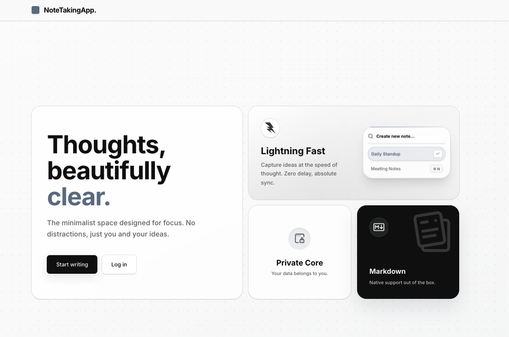
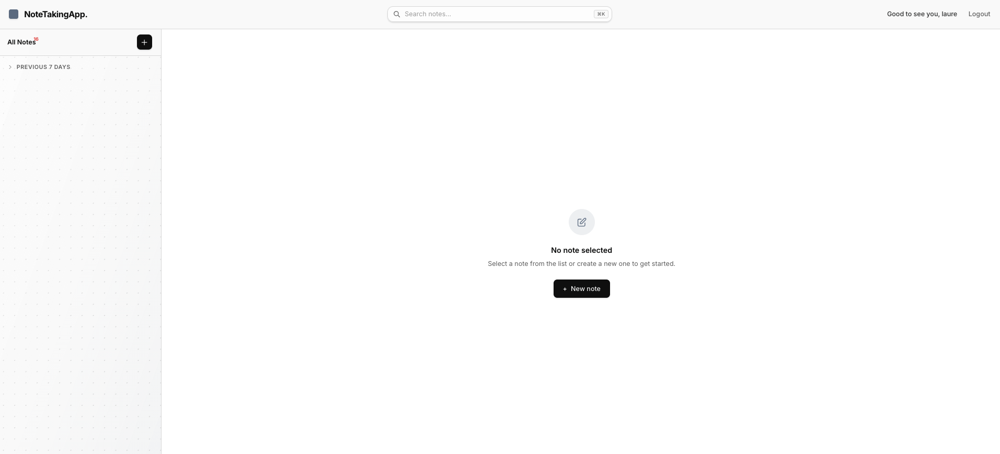

# NoteTakingApp

A note-taking application built with **Flask** and **Tailwind CSS**. NoteTakingApp offers a clean interface for capturing ideas, organizing thoughts, and managing your daily tasks with ease.

> PS: I am using this note-taking app to take notes in my daily work.


## Tech Stack

- **Backend**: Python, Flask, Flask-SQLAlchemy, Flask-Login, Flask-Migrate
- **Frontend**: Tailwind CSS, Jinja2 Templates
- **Database**: SQLite (Development)

## Getting Started

### Prerequisites

- Python 3.8+
- Node.js & npm (for Tailwind CSS development)

### Installation

1. **Clone the repository**:
   ```bash
   git clone https://github.com/jaygaha/note-taking-app.git
   cd note-taking-app
   ```

2. **Set up Virtual Environment**:
   ```bash
   python -m venv .venv
   source .venv/bin/activate  # MacOS/Linux
   # .venv\Scripts\activate  # Windows
   ```

3. **Install Dependencies**:
   ```bash
   pip install -r requirements.txt
   ```

4. **Initialize Database**:
   ```bash
   flask db upgrade
   ```

### Running the Application

Start the development server:
```bash
python run.py
```
The application will be available at `http://127.0.0.1:5000`.

## Frontend Development

NoteTakingApp uses Tailwind CSS for styling. To compile styles during development:

```bash
# Watch for changes and recompile
npx tailwindcss -i app/static/src/input.css -o app/static/dist/output.css --watch

# Build for production
npx tailwindcss -i app/static/src/input.css -o app/static/dist/output.css --minify
```

## Project Structure

```text
├── app/
│   ├── auth/           # Authentication blueprints & logic
│   ├── main/           # Core application routes
│   ├── notes/          # Note-specific functionality (CRUD)
│   ├── static/         # Dynamic & source CSS, JS, images
│   ├── templates/      # Jinja2 HTML templates
│   ├── models.py       # Database schemas (SQLAlchemy)
│   └── utils.py        # Shared helper functions
├── instance/           # Local database (SQLite)
├── migrations/         # Database migration history
├── config.py           # Application configuration
└── run.py              # Application entry point
```

## Demo

**Home**



**Dashboard**




## Contributing

If you have an idea to improve this note-taking app, feel free to fork, open an issue or submit a pull request.

Happy coding! 🚀